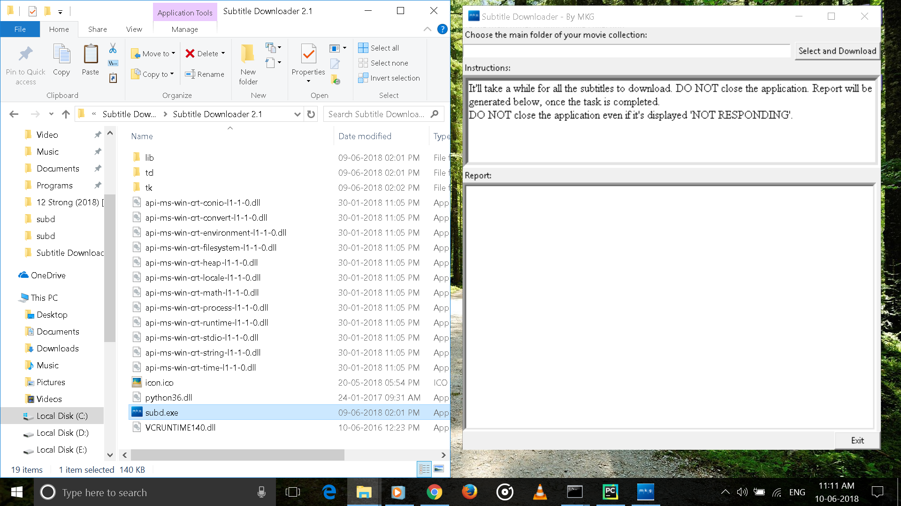
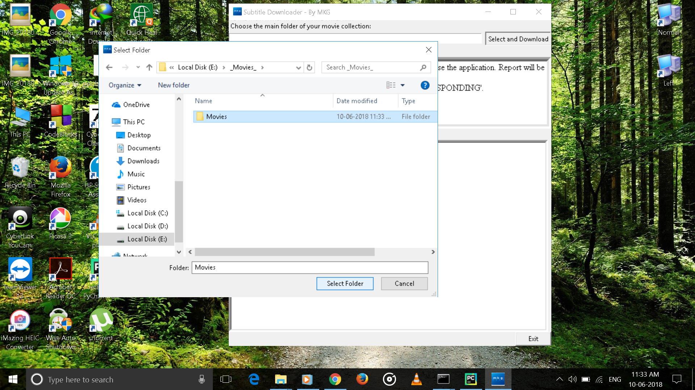
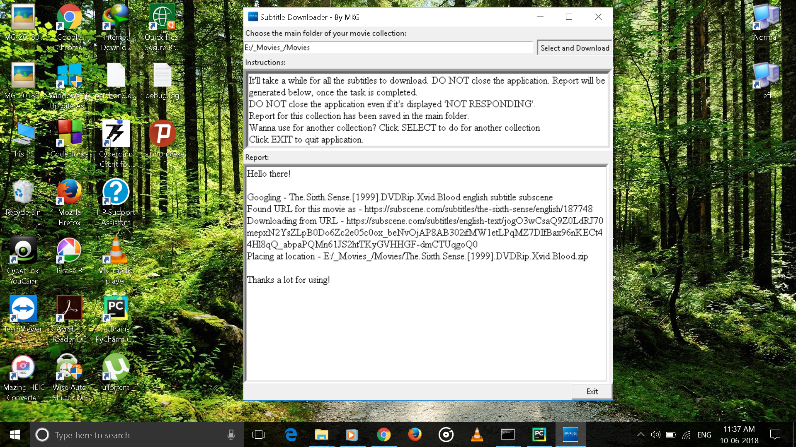

# Subtitle Downloader
A Windows application for downloading English subtitles for local (on our hard drives) movie collections.

## Downloading and Installing
Subtitle Downloader can be downloaded from the 'Windows Application' folder above which contains both ZIP of Installed folder and an installer (SFX Archive, Self extracting EXE), either of which can be downloaded. The EXE is small sized and easy to share.
The following links can also be used for downloading -

  * Installed folder (ZIP): https://drive.google.com/open?id=1O2VLhp3bfIM5cDZx5kOiCoMV8VuCZzC2
  * SFX Archive (Self Extracting EXE): https://drive.google.com/open?id=1n3xFh_rkL8QwZvHON8CRY2H2glyhrQxe

## Using
We just need to choose the main folder of our movie collection, i.e., the folder that contains all movies and other sub-folders containing movies. The application will download subtitles for all the movies inside the main folder and place them with the respective movies. At last, a report `Report.txt` will be saved in the main folder which will contain details of which subtitles were downloaded successfully and where problems occurred.

*After selecting the folder, the app starts working. Windows may display `Not Responding`, but, DO NOT close the application till a reasonable time (2-3 minutes for a small collection having around 15-20 movies)*

Follow the steps below for using - 
* After extracting to any desired location (through ZIP or EXE), open `subd.exe` to run the application.

  

* Click on `SELECT` to choose the main folder of collection. As soon as we click on 'Select Folder' after choosing, app starts working in background.

  

* As soon as it finishes downloading, Report is displayed and saved in the folder selected. To use for another collection, select folder again. To quit, click on `EXIT`.

  

